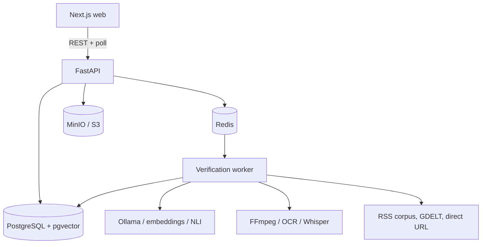

# Evidence-Backed Verification Platform

Anonymous visitors submit a claim, article URL, public social post, image,
screenshot, or video. The system finds evidence and reports what that evidence
establishes — with sources, dates, and excerpts you can check yourself.

> **Do not ask AI what is true. Find evidence first, then evaluate what the
> evidence establishes.**

This is not an "AI fake news detector". It never shows a mysterious
`TRUE — 98.73%`. Every conclusion traces back to evidence a reader can click
through, and when the evidence is insufficient the honest answer is `UNVERIFIED`
— which is never a synonym for `FALSE`.

---

## Build status

V1 is **in progress**. This table is the honest state of the build, not a plan.

| Area | Status |
|---|---|
| Documentation, project rules | Done |
| SSRF-safe fetch layer | Done — 131 tests |
| Prompt-injection isolation | Done — 35 tests |
| Domain models (15 tables) | Done |
| Deterministic scoring engine | Done — 44 tests |
| Infrastructure (Postgres+pgvector, Redis, MinIO) | Done — running, migrated |
| FastAPI app, 11 API endpoints | Done — verified live |
| Job queue and worker | Done — retries, dead-letter, crash recovery |
| Claim extraction (rule-based, EN + BN) | Done — 40 tests |
| **Frontend (composer, progress, report)** | **Done — verified in browser** |
| Evidence retrieval (RSS, GDELT, hybrid search) | Not started |
| Evidence extraction and classification | Not started |
| Image / video / social pipelines | Not started |

**321 unit + 4 integration tests pass.** The end-to-end path works today:
submit → API → PostgreSQL → Redis → worker → persisted stages → report page.

Because retrieval is not built yet, every verification honestly returns
`UNVERIFIED` and says so: no sources are searched, so no evidence exists. The
report states plainly that this does not mean the claim is false. No fixture
data is ever presented as real evidence.


---

## Principles

These are enforced in code and tests, not just stated:

1. **Never fabricate evidence.** No invented citations, URLs, dates, authors, or
   image origins. Insufficient evidence yields `UNVERIFIED`.
2. **No paid runtime APIs.** The app runs with zero API keys. Local only:
   Ollama, sentence-transformers, Tesseract, faster-whisper.
3. **No authentication in V1.** No accounts, sessions, or profiles. Abuse control
   is Redis rate limiting on hashed client fingerprints.
4. **The LLM never decides the verdict.** Scoring is pure, deterministic
   arithmetic over labeled evidence. A model that gets successfully prompt-injected
   still cannot move a verdict, because it has no channel to write one.
5. **All retrieved content is untrusted data**, never instructions.
6. **Honest capability claims.** We do not have internet-wide search or reverse
   image search, and we never imply otherwise.

---

## Architecture



Submission is cheap and synchronous (validate, store, enqueue, return an id).
Everything expensive happens in the worker. Full detail in
[docs/ARCHITECTURE.md](docs/ARCHITECTURE.md).

```
apps/web/          Next.js frontend (not yet scaffolded)
backend/app/
  api/             HTTP routes (thin)
  core/            config, logging, errors, versions, ids
  db/ models/      SQLAlchemy ORM
  schemas/         Pydantic contracts
  services/        submission, orchestration, storage, rate limiting
  verification/    pipeline state machine + deterministic scoring
  retrieval/       providers, hybrid search, ranking, clustering
  media/           image, video, OCR, transcription
  ai/              provider protocols, untrusted-content fencing
  security/        safe_fetch, url_validation, upload validation
docs/              product, architecture, database, scoring, security, ...
infrastructure/    compose configs, feed configuration
```

---

## Requirements

| Tool             | Version        | Required?                                                    |
| ---------------- | -------------- | ------------------------------------------------------------ |
| Python           | **3.12** | Yes — not 3.13, whose ctranslate2/faster-whisper wheels lag |
| Node             | 20+            | For the frontend (once it exists)                            |
| pnpm             | 9+             | Frontend package manager                                     |
| Docker + Compose | recent         | For PostgreSQL, Redis, MinIO                                 |
| FFmpeg + ffprobe | 6+             | Video processing                                             |
| Ollama           | latest         | Optional — claim extraction degrades without it             |
| Tesseract        | 5+             | Optional — OCR degrades without it                          |

**Everything optional genuinely is optional.** The app boots, serves, and passes
its full default test suite with no Ollama, no Tesseract, no ML extras, no
network, and no Docker. Missing tools cause a *documented downgrade* recorded in
the report — never a crash, and never a wrong verdict.

---

## Setup

### Backend

```bash
cd backend
py -3.12 -m venv .venv
.venv/Scripts/python -m pip install -e ".[dev]"     # Windows
# source .venv/bin/activate && pip install -e ".[dev]"   # macOS / Linux

.venv/Scripts/python -m pytest                       # 210 tests, offline
```

Optional extras, installed only if you want those capabilities:

```bash
pip install -e ".[ml]"    # sentence-transformers, torch, transformers
pip install -e ".[ocr]"   # pytesseract
pip install -e ".[stt]"   # faster-whisper
pip install -e ".[cv]"    # opencv
```

### Services

```bash
docker compose up -d postgres redis minio
```

### Environment

```bash
cp .env.example .env
```

Never commit a real `.env`. Every setting lives in
[`backend/app/core/config.py`](backend/app/core/config.py) — add a field there
and a line to `.env.example` rather than calling `os.getenv` anywhere else.

### Ollama (optional)

```bash
# Install from https://ollama.com, then:
ollama pull llama3.2:3b            # OLLAMA_TEXT_MODEL
ollama pull llama3.2-vision:11b    # OLLAMA_VISION_MODEL
ollama serve                       # serves on :11434
```

Model names are configuration, never hardcoded. Pick smaller models on modest
hardware and set `OLLAMA_TEXT_MODEL` accordingly.

---

## Commands

```bash
# Backend (from backend/)
.venv/Scripts/python -m pytest                    # default: offline, deterministic
.venv/Scripts/python -m pytest -m integration     # needs docker compose up
.venv/Scripts/python -m pytest -m live            # needs internet (GDELT, RSS)
.venv/Scripts/python -m ruff check . && .venv/Scripts/python -m ruff format .
.venv/Scripts/python -m mypy app
```

Test markers keep the core suite trustworthy offline: `integration` (needs
services), `live` (needs internet), `slow`, `heavy` (needs ML extras). A bare
`pytest` run excludes all four.

```bash
# Backend services (from repo root)
docker compose up -d                      # Postgres :55432, Redis :56379, MinIO :59000

# Migrations (from backend/)
.venv/Scripts/python -m alembic upgrade head

# API server (from backend/) - use run_api.py, not `uvicorn` directly:
# psycopg's async driver cannot use Windows' default ProactorEventLoop.
.venv/Scripts/python run_api.py --port 8123

# Verification worker (from backend/)
.venv/Scripts/python -m app.workers.worker

# Frontend (from apps/web/)
pnpm dev --port 3100
pnpm build / pnpm typecheck / pnpm lint
```

Ports are deliberately non-default: this machine already runs other stacks on
5432, 6379, 9000, and 8000.

---

## Verdicts

`VERIFIED · LIKELY_TRUE · PARTLY_TRUE · MISLEADING · UNVERIFIED · LIKELY_FALSE · FALSE · SATIRE · OPINION`

The cases that are easy to get wrong, and that the test suite pins down:

- **Absence of evidence is not evidence of absence.** Unverifiable is
  `UNVERIFIED`, never `FALSE`.
- **Volume is not corroboration.** Fifty sites republishing one wire story is one
  origin. Syndicated copies are clustered and damped, and can never reach
  `VERIFIED` on their own.
- **A real image can carry a false claim.** An authentic photo with a
  three-year-old origin captioned "today" is `MISLEADING`, and the report says
  plainly that the image itself showed no manipulation signals. Integrity and
  context are reported separately.
- **Exaggerated research is `PARTLY_TRUE`**, not `FALSE`.
- **A screenshot is not proof** the depicted post is genuine.
- **A technical failure is not a verdict.** Ollama down or a fetch timeout is
  reported as a failure, never converted into `FALSE`.

Confidence is shown as `LOW / MEDIUM / HIGH`. There is no percentage anywhere in
the UI, the numeric score exists only for debugging and future calibration.
Formula: [docs/SCORING.md](docs/SCORING.md).

---

## Known limitations

Stated in the product, not buried here:

- **No internet-wide search.** Retrieval covers our indexed RSS corpus, GDELT,
  and URLs you give us. Reports name the sources actually checked.
- **No reverse image search.** Matching is limited to our own corpus, perceptual
  hashes, and embeddings. Unknown origins are reported as unknown, never guessed.
- **Scoring is uncalibrated.** The formula is explainable and tested, not
  validated against labeled data. The weights are engineering judgement.
- **English and Bangla only**, and cross-language quality depends on the
  multilingual embedding model.
- **Local models are modest.** Ollama-class models extract claims less reliably
  than frontier models; the deterministic scoring layer is what keeps output
  trustworthy despite that.
- Paywalled, private, deleted, and login-gated content is inaccessible. We report
  that honestly and never attempt to bypass it.

---

## Security

Full threat model: [docs/SECURITY.md](docs/SECURITY.md).

- **SSRF.** All user-influenced fetching funnels through
  `app/security/safe_fetch.py`, validated at four points: URL parse, DNS (every
  resolved address), connect (pinned IP with peer re-check, defeating DNS
  rebinding), and every redirect hop. Blocks loopback, RFC1918, CGNAT,
  link-local including cloud metadata `169.254.169.254`, and obfuscated IP
  encodings (decimal, hex, octal, short-form, IPv4-mapped IPv6). Response size is
  capped while streaming.
- **Prompt injection.** Retrieved text is fenced with a per-call random nonce, so
  content cannot forge a closing marker. Bidi overrides, zero-width characters,
  and ANSI escapes are stripped. Instruction-like text is *reported* rather than
  removed — deleting it would let an attacker erase inconvenient evidence. The
  real guarantee is structural: verdicts come from deterministic scoring, so an
  injection has nothing to write to.
- **Uploads.** Declared MIME and magic bytes must agree; decompression bombs are
  capped before full decode; storage keys are generated, never taken from user
  filenames; subprocesses use argv lists with `shell=False` and timeouts, so no
  user value reaches a shell and a filename cannot become a flag.
- **Privacy.** Raw client IPs are never stored in PostgreSQL. Rate limiting uses
  salted hashes in Redis with a TTL. Submissions are public by design.

Security overrides convenience. If a test is hard to write against these
protections, the fix is a narrowly-scoped fixture — never a global bypass.

---

## Documentation

| Doc                                                      | Contents                                          |
| -------------------------------------------------------- | ------------------------------------------------- |
| [PRODUCT.md](docs/PRODUCT.md)                             | What this is, verdict taxonomy, limitations       |
| [ARCHITECTURE.md](docs/ARCHITECTURE.md)                   | Components, seams, degradation matrix             |
| [DATABASE.md](docs/DATABASE.md)                           | Model map and table reference                     |
| [VERIFICATION_PIPELINE.md](docs/VERIFICATION_PIPELINE.md) | Stage machine, failure handling                   |
| [RETRIEVAL.md](docs/RETRIEVAL.md)                         | Providers, hybrid search, independence clustering |
| [MEDIA_PIPELINE.md](docs/MEDIA_PIPELINE.md)               | Image, screenshot, video processing               |
| [SCORING.md](docs/SCORING.md)                             | The deterministic formula, versioned              |
| [SECURITY.md](docs/SECURITY.md)                           | Threat model and controls                         |
| [API.md](docs/API.md)                                     | Endpoints and conventions                         |
| [ROADMAP.md](docs/ROADMAP.md)                             | Phases, limitations, what comes after V1          |

[CLAUDE.md](CLAUDE.md) holds permanent project instructions;
[.claude/rules/](.claude/rules/) holds detailed per-area rules.
