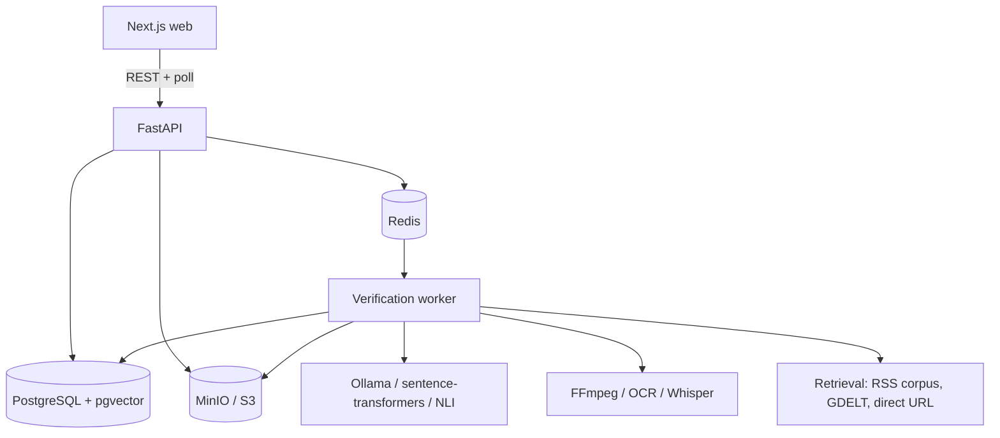
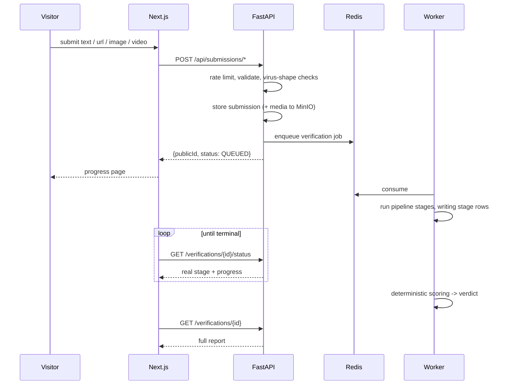

# Architecture

## Shape

One Next.js frontend, one FastAPI backend, one worker process, three backing
services. Not microservices — V1 gets a well-layered monolith with clean seams
where a split would later be cheap.



Submission is synchronous and cheap (validate, store, enqueue, return an id).
Everything expensive happens in the worker. The HTTP request never waits on a
model.

## Why these seams

The boundaries that matter are the ones we expect to change:

- **Providers are protocols** (`LLMProvider`, `EmbeddingProvider`,
  `EvidenceClassifier`, `RetrievalProvider`, `OCREngine`,
  `TranscriptionProvider`, `ObjectStorage`, `SocialContentResolver`). Every one
  has a real implementation, a fake for tests, and a documented degraded mode.
  Domain code never names a concrete provider or a model string.
- **Scoring is pure.** `verification/scoring.py` takes signals and returns a
  verdict with a breakdown. No I/O, no model calls, no clock reads. This is what
  makes verdicts testable and reproducible.
- **Safe fetch is a chokepoint.** Every user-influenced outbound request goes
  through `security/safe_fetch.py`. One place to audit.
- **Untrusted content is fenced at one function.** `ai/untrusted.py` is the only
  path by which retrieved text reaches a prompt.

## Layout

```
apps/web/              Next.js App Router frontend
backend/app/
  api/                 HTTP routes (thin) + dependencies
  core/                config, logging, errors, versions, ids
  db/                  session, base, migrations wiring
  models/              SQLAlchemy ORM
  schemas/             Pydantic request/response + AI output contracts
  services/            submission, verification orchestration, storage, rate limit
  verification/        pipeline state machine, stages, scoring, aggregation
  retrieval/           providers, hybrid search, ranking, clustering, ingestion
  media/               image, video, ocr, transcription, exif, hashing
  ai/                  provider protocols, ollama, embeddings, NLI, prompts
  workers/             queue consumer, job definitions
  security/            safe_fetch, upload validation, sanitization
backend/tests/         unit + integration + fixtures
docs/                  this documentation
infrastructure/        compose configs, init scripts, feed config
```

## Request lifecycle



## Pipeline stages

`QUEUED -> NORMALIZING -> EXTRACTING_CONTENT -> DETECTING_LANGUAGE ->
EXTRACTING_CLAIMS -> GENERATING_QUERIES -> RETRIEVING_EVIDENCE ->
FETCHING_DOCUMENTS -> EXTRACTING_EVIDENCE -> CLASSIFYING_EVIDENCE ->
[ANALYZING_MEDIA] -> SCORING -> GENERATING_REPORT -> COMPLETED | FAILED`

`ANALYZING_MEDIA` runs only when media exists. Each stage writes a
`VerificationStage` row with status, timing, and error type, so the progress UI
reflects reality rather than an animation. See `docs/VERIFICATION_PIPELINE.md`.

## Degradation

The environment is assumed incomplete. Ollama absent, Tesseract absent, no
network, no Docker — each is a *documented downgrade*, never a crash:

| Missing | Effect |
|---|---|
| Ollama | Rule-based claim extraction; NLI-only classification; report notes reduced depth |
| sentence-transformers | Keyword-only retrieval (no vector leg); noted in the report |
| NLI model | Ollama classification if available, else `INSUFFICIENT` for unresolved pairs |
| Tesseract | OCR stage marked `unavailable` — never reported as "no text found" |
| faster-whisper | Transcript stage marked `unavailable`; caption/on-screen claims still run |
| Network | Only the local corpus and direct URLs; coverage score drops accordingly |

A degraded run is labeled degraded in the report. We never let a missing tool
silently look like a finding.

## Versioning

Every result records `pipeline_version`, `scoring_version`, `retrieval_version`,
plus embedding model, LLM model, prompt, and classifier versions
(`core/versions.py`). Re-verification creates a new `VerificationRevision`; prior
results are preserved, never overwritten.

## Technology

Next.js/TypeScript/Tailwind/shadcn/TanStack Query/Zod. Python 3.12/FastAPI/
Pydantic v2/SQLAlchemy 2.0/Alembic. PostgreSQL 16 + pgvector, Redis 7, MinIO.
Ollama, sentence-transformers, local NLI, Tesseract, faster-whisper, FFmpeg,
OpenCV, Pillow, imagehash, Trafilatura. Pytest, Vitest, Playwright. Docker Compose.
