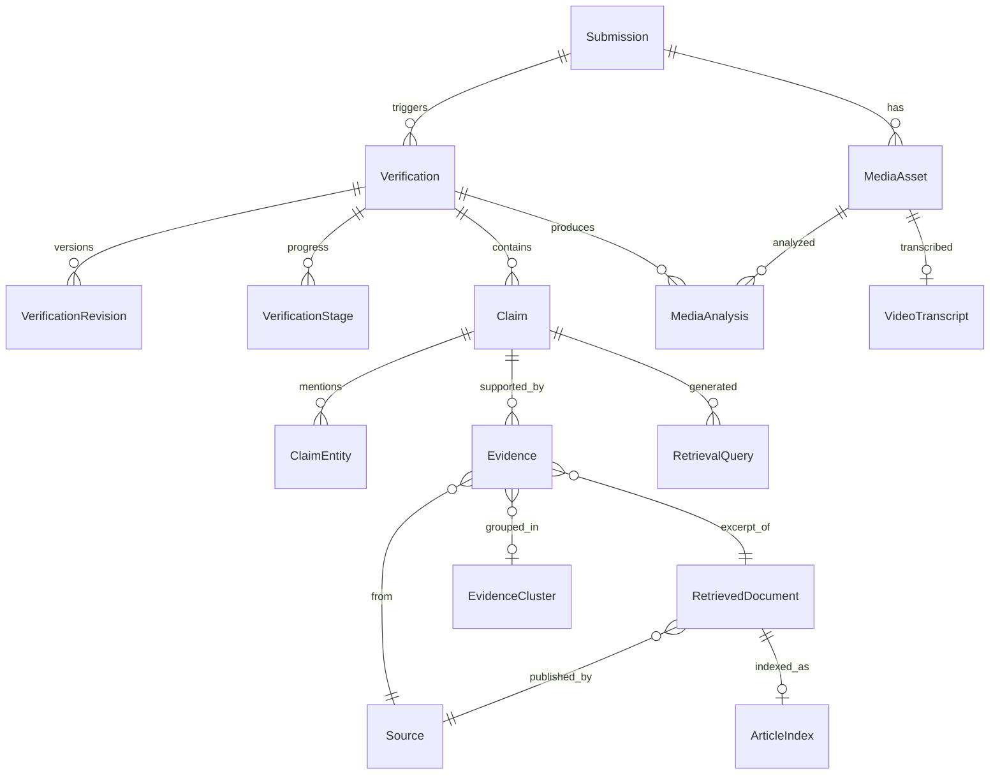

# Database

PostgreSQL 16 + pgvector. SQLAlchemy 2.0 typed ORM, Alembic migrations.

## Model map

## Tables

**Submission** — what the visitor sent. `id` (serial, internal), `public_id`
(opaque `sub_...`), `content_type` (TEXT, ARTICLE_URL, SOCIAL_URL, IMAGE,
SCREENSHOT, IMAGE_WITH_CAPTION, VIDEO, VIDEO_WITH_CAPTION), `title`, `text`,
`caption`, `submitted_url`, `detected_language`, `content_hash`, `status`,
timestamps. No user column, no raw IP.

**MediaAsset** — one uploaded file. Storage key, bucket, MIME, byte size,
SHA-256, dimensions, duration, perceptual hash, original filename kept as inert
metadata only. Binaries live in MinIO; only metadata is here.

**Verification** — one verification run. `public_id` (`vfy_...`), submission FK,
`status`, `overall_verdict`, `confidence_band`, `summary`, `scoring_version`,
`pipeline_version`, `retrieval_version`, `degraded` + `degradation_reasons`,
started/completed timestamps.

**VerificationRevision** — immutable snapshot of a completed run (verdict,
confidence, summary, full score breakdown, all model/prompt versions). Re-running
appends; nothing is overwritten.

**VerificationStage** — one row per pipeline stage: name, status, sequence,
started/finished, duration_ms, error_type, error_message, metadata. This is what
the progress UI reads, which is why progress cannot drift from reality.

**Claim** — an atomic checkable assertion. `claim_text`, `normalized_claim`,
`language`, `subject`, `predicate`, `object`, `claim_type`, `origin`
(USER_CAPTION, VIDEO_TRANSCRIPT, ON_SCREEN_TEXT, ARTICLE_TEXT, SOCIAL_POST_TEXT,
OCR_TEXT), `importance`, `verdict`, `confidence`, score breakdown JSON. Extracted
values (dates, numbers, money, percentages, locations) are typed JSONB so numeric
and temporal comparison operate on parsed values, not strings. Fields are
nullable — not every claim has every part.

**ClaimEntity** — normalized entity mentions with type and offsets, used for
entity-overlap ranking and entity-mismatch penalties.

**Source** — a publisher. Domain (unique), name, `source_type`, language, country,
primary-source categories. No trust score by domain name.

**RetrievedDocument** — a fetched document. Canonical URL, title, author,
published/modified dates, excerpt, content hash, SimHash, language, source FK,
retrieval provider, fetch status. Full body is not persisted here.

**ArticleIndex** — search representation: tsvector for FTS plus a pgvector
embedding, with the embedding model version. Split from RetrievedDocument so
re-embedding under a new model does not rewrite document rows.

**Evidence** — a claim/passage pair. Claim FK, document FK, source FK,
`evidence_text` (minimum necessary excerpt), `relationship`, `relevance_score`,
`strength_score`, `temporal_relevance`, factor breakdown, `cluster_id`,
classifier name and version.

**EvidenceCluster** — an origin group. Representative document, member count,
clustering method and score. Implements the independence rule from
`docs/SCORING.md`.

**MediaAnalysis** — per-asset findings, keeping **integrity separate from
context**: EXIF/metadata, hashes, dimensions, manipulation signals, OCR text and
engine, corpus match results, and availability flags per sub-analysis.

**VideoTranscript** — transcript text, segments with timestamps, language, model
name and version, duration processed, truncation flag.

**RetrievalQuery** — every query we issued: text, language, provider, result
count, duration, error. Makes "what did we actually search" auditable and is the
basis for the sources-checked report section.

## Conventions

- Serial `id` internal only; `public_id` is opaque and is the sole external
  identifier. No enumerable IDs in URLs or APIs.
- Enums are Python enums persisted as strings, guarded by DB constraints.
- Everything timezone-aware UTC.
- Indexes: `public_id` unique, FKs, `content_hash`, `Source.domain`, GIN on the
  FTS vector, HNSW on embeddings, and composite indexes on the recent/search paths.
- JSONB for genuinely variable structures (breakdowns, extracted values, EXIF)
  only — never as a substitute for modelling a real relation.
