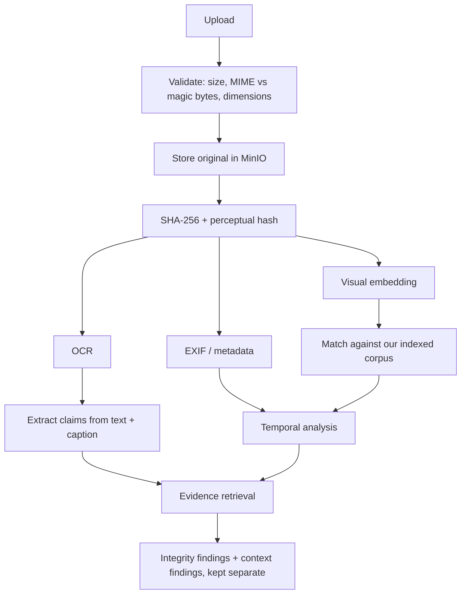
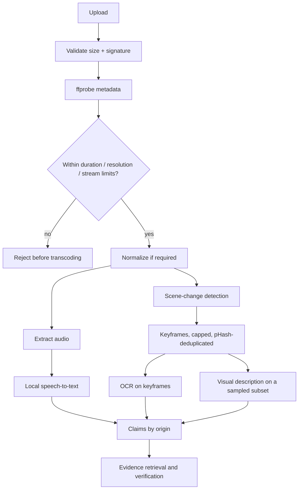

# Media pipeline

The governing distinction: **media integrity** (was this file manipulated?) is
reported separately from **claim context** (does it show what the caption says?).
Merging them into one number destroys the most common misinformation case — a
completely authentic photo with a false caption.

## Images

EXIF gives capture date, device, and software traces (an editor in the software
field is a signal worth reporting, not proof of forgery). Perceptual hashing finds
near-duplicates that survive resizing and recompression. The temporal check is the
high-value one: if a matched corpus copy predates the claimed event, the image is
recycled regardless of how authentic the pixels are.

### Stated limitations

We do **not** have reverse image search. We can find exact and near matches in our
own corpus, compare perceptual hashes and embeddings, read embedded text and EXIF,
and search extracted text — that is all. When we cannot identify an original
source we say we could not. We never guess one, and we never imply we searched
the web.

## Screenshots

Handled distinctly, because a screenshot is evidence that an *image* exists, not
that the depicted post is genuine. OCR extracts the visible headline, account
name, handle, timestamp, engagement numbers, and publication marks; claims are
extracted from that text and checked against textual evidence, along with whether
the depicted account and publication plausibly exist and whether the visible date
is consistent. Reports say plainly that we verified the *claim shown*, not the
authenticity of the screenshot.

## Video

Limits are checked from `ffprobe` output **before** any transcoding, so an
oversized or malformed file is rejected cheaply. Never feed every frame to a
vision model: scene-change detection proposes candidates, the count is capped at
`MAX_KEYFRAMES`, and perceptual-hash deduplication removes near-identical frames
before any model call.

### Provenance of claims

Claims keep their origin — `USER_CAPTION`, `VIDEO_TRANSCRIPT`, `ON_SCREEN_TEXT`,
`OCR_TEXT` — and are verified independently. An authentic video whose transcript
checks out can accompany a false user caption; the report must show the video as
sound and the caption as false rather than averaging them into one verdict.

## Safety

Uploads are hostile input. Declared type and magic bytes must agree; decompression
bombs are capped by pixel and dimension limits before full decode; storage keys
are generated, never taken from user filenames. FFmpeg and OCR run as argv lists
with `shell=False`, per-call timeouts, and killed processes on expiry — no user
value ever reaches a shell, and a filename cannot become a flag. Details in
`docs/SECURITY.md`.

## Degradation

Tesseract and faster-whisper are optional and frequently absent. A missing engine
marks its stage `unavailable` with a reason and the pipeline continues on the
remaining signals. A missing OCR engine is never reported as "no text found" —
that would turn our own gap into a finding about the user's content.
