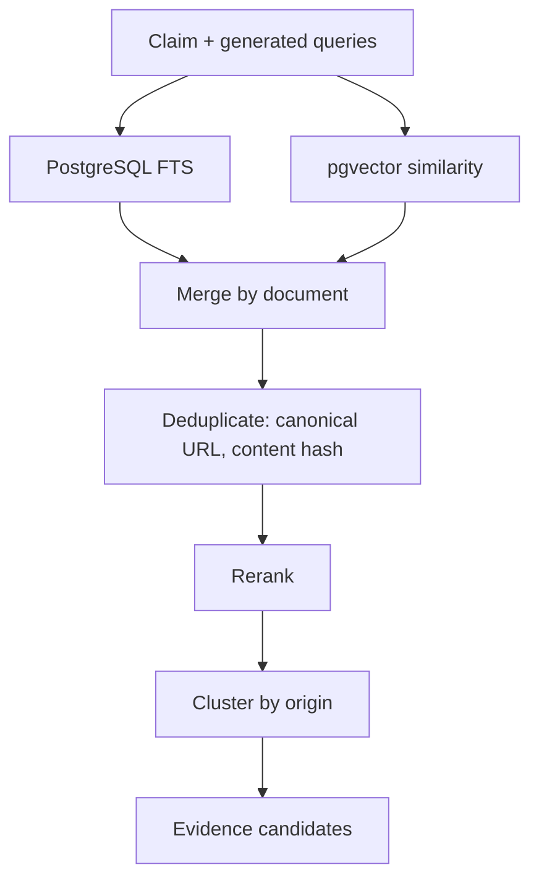

# Retrieval

## Honest scope

We do not have internet-wide search. We have an indexed corpus, a public news
index, and whatever URL the user hands us. Every report names the sources actually
checked, and coverage feeds the confidence band. We never imply broader reach.

## Providers

`RetrievalProvider` protocol; results normalize to one internal shape regardless
of origin.

| Provider | Source | Notes |
|---|---|---|
| `IndexedCorpusProvider` | Our PostgreSQL corpus | Hybrid FTS + pgvector. Primary provider. |
| `GDELTProvider` | GDELT DOC 2.0 API | Free, no key. Broad current-news coverage. |
| `RSSCorpusProvider` | Configured feeds | Ingested by worker into the corpus. |
| `DirectURLProvider` | The submitted URL itself | Safe-fetched, extracted. |
| `ConfiguredOfficialSourceProvider` | Primary-source registry | Claim-type routed (seismology, meteorology, etc.). |

Every provider is timeout-bounded, deduplicates, tolerates malformed or partial
responses, and degrades to returning nothing rather than raising. **We do not
scrape search engines or bypass protections.**

## Feeds are configuration

`infrastructure/feeds.yaml`, not code. Fields: name, url, domain, language,
country, category, source_type, enabled. Ingestion fetches, parses, normalizes,
deduplicates by canonical URL and content hash, extracts metadata, indexes text
for FTS, and generates embeddings.

## Hybrid search

Keyword search catches exact names, numbers, and rare terms that embeddings blur.
Vector search catches paraphrase and cross-language restatement. Neither is
sufficient alone. Merged with reciprocal rank fusion so neither leg's raw score
scale dominates, then reranked on semantic similarity, keyword overlap, entity
overlap, date relevance, location relevance, source characteristics, and freshness.

Ranking weights live in one config block and are tested against fixtures. No
factor is allowed to dominate untested.

## Cross-language

Misinformation often circulates in Bangla while primary reporting is in English
(and vice versa). We keep the original text, and generate queries in both the
detected language and English. Multilingual embeddings let a Bangla claim match an
English document directly. We never translate away the original.

## Source independence

Fifty reprints of one wire story are one origin. Clustering uses canonical URL,
content hash, SimHash near-duplicate detection, embedding similarity, shared
verbatim passages, publication timing, and syndication markers (agency credits,
bylines, a canonical link pointing to another domain).

The strongest item in a cluster counts fully; the rest are damped (see
`docs/SCORING.md`). The independent-origin count gates the strongest verdicts —
you cannot reach `VERIFIED` on one origin no matter how many copies exist. This is
a pragmatic V1 heuristic, not a provenance graph.

## Primary sources

Some claim types have a natural authority: earthquakes to seismological agencies;
weather to meteorological services; company announcements to the company newsroom,
investor relations, or a regulatory filing; research to the original paper or
journal; policy to official publication. A registry maps claim types to primary
domains, raising retrieval priority and evidence weight.

This is **not** a truth whitelist. No domain is trusted by name; primary-source
status only raises how much a relevant passage counts.

## Article extraction

Validate, then SSRF-safe fetch, then canonical URL, title, author, publication and
update dates, main text via Trafilatura (BeautifulSoup fallback), language,
content hash, cache. Playwright only where plain HTTP genuinely cannot retrieve
public content. We never bypass paywalls, CAPTCHAs, or authentication; if content
is inaccessible we report that honestly.

## Copyright

We store and display metadata, URL, title, publisher, date, hashes, embeddings,
and the minimum excerpt needed to justify a verdict — never full article bodies.
Full text exists only in a temporary extraction cache with a TTL. The public
product is not a republishing platform.
