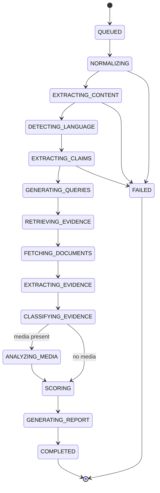

# Verification pipeline

A real state machine in `app/verification/pipeline.py`. Each stage writes a
`VerificationStage` row (status, started/finished, duration, error type, metadata),
so the progress UI shows what is actually happening.

## Stages

| Stage | Does | Skipped when | On failure |
|---|---|---|---|
| `NORMALIZING` | Canonicalize input, hash content, detect submission shape | never | fatal |
| `EXTRACTING_CONTENT` | Fetch URL / read upload / resolve social link | text-only | fatal for URL, else degrade |
| `DETECTING_LANGUAGE` | Detect language per text block | no text | default `en`, continue |
| `EXTRACTING_CLAIMS` | Decompose into atomic claims with entities/dates/numbers | never | fatal (nothing to verify) |
| `GENERATING_QUERIES` | Build retrieval queries, incl. cross-language | no claims | degrade to keyword-only |
| `RETRIEVING_EVIDENCE` | Query all enabled retrieval providers | no queries | degrade, coverage drops |
| `FETCHING_DOCUMENTS` | Safe-fetch and extract candidate documents | no candidates | per-doc, continue |
| `EXTRACTING_EVIDENCE` | Select claim-relevant passages | no documents | continue with none |
| `CLASSIFYING_EVIDENCE` | Label SUPPORTS/CONTRADICTS/NEUTRAL/INSUFFICIENT | no passages | mark INSUFFICIENT |
| `ANALYZING_MEDIA` | EXIF, hashes, OCR, keyframes, transcript, corpus match | no media | degrade, note it |
| `SCORING` | Deterministic aggregation | never | fatal |
| `GENERATING_REPORT` | Summary + explanation from stored evidence | never | fatal |

"Fatal" means the verification ends `FAILED` with a stated reason. **A failure is
never converted into a substantive verdict.** If we could not check, the answer is
`UNVERIFIED` or `FAILED` — never `FALSE`.

## Degradation, not collapse

Most stages degrade. Missing Ollama means rule-based claim extraction; missing
embeddings means keyword-only retrieval; missing OCR marks that stage
`unavailable` (never "no text found"). Any degradation is recorded on the
verification, shown in the report's methodology section, and caps confidence at
`MEDIUM`.

## Jobs

Redis-backed. Each job is idempotent on `verification_id` — a redelivered job
resumes from the last completed stage rather than duplicating work. Bounded
retries with backoff apply to transient errors (network, provider timeout);
deterministic errors (invalid media) fail immediately without retry. Exhausted
retries move to a dead-letter state with the error preserved. Every stage has a
timeout; the whole job has a wall-clock budget.

## Re-verification

A re-run creates a new `VerificationRevision` and never mutates prior results, so
"this was UNVERIFIED yesterday and is VERIFIED today" stays visible. Each revision
records the pipeline, scoring, retrieval, model, and prompt versions in force when
it ran.
